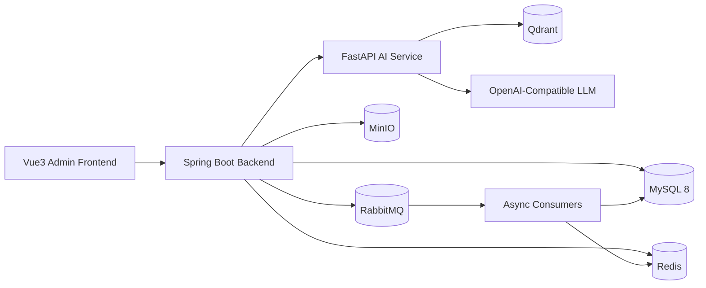

# PromoBrain

PromoBrain 是一个面向电商广告推广场景的智能知识库与广告投放模拟平台。系统将商品资料、广告规则、用户评价、历史优秀文案等内容沉淀为知识库，并围绕广告推广场景实现关键词多路召回、广告素材生成、候选排序、预算扣减、素材审核和效果分析。

项目后端基于 Spring Boot 3，使用 Redis Lua 实现广告预算原子扣减，通过 requestId 和数据库唯一索引保证点击扣费幂等；使用 RabbitMQ 异步处理曝光点击日志、预算流水和素材审核任务；AI 服务基于 FastAPI，支持文档切分、Embedding、向量检索、广告文案生成和推广 Agent。

## 项目定位

PromoBrain 不是通用 RAG 问答系统，也不是单纯的 AI 文案 Demo。它的目标是做一个轻量但完整的广告推广业务闭环：

- 商品中心：维护广告推广对象、卖点、目标人群、用户痛点和关键词。
- 知识库：沉淀商品资料、广告规则、用户评价、历史文案、竞品资料和 FAQ。
- 素材生成：基于商品知识和广告规则生成多候选广告文案。
- 关键词推荐：通过商品标题、卖点、评价、历史词、竞品词、向量召回和热门词多路召回。
- 候选排序：综合相关性、预估 CTR、预估 CVR、毛利和风险分进行重排。
- 广告计划：支持创建、发布、暂停、预算管理和投放模拟。
- 预算扣减：Redis Lua 原子扣减，requestId 幂等，MQ 异步落库。
- 效果看板：展示曝光、点击、CTR、CVR、消耗、GMV 和 ROI。
- 轻量 RBAC：支持平台管理员、商家管理员、广告运营和数据分析员。

## 架构图



## 技术栈

- Frontend: Vue3, TypeScript, Vite, Element Plus, Pinia, Vue Router, Axios, ECharts, Markdown renderer, SSE
- Backend: Java 17, Spring Boot 3, MyBatis Plus, Sa-Token, JWT, Redis, Redisson, RabbitMQ, MinIO, Knife4j, Maven
- AI Service: Python 3.10+, FastAPI, Uvicorn, Embedding Provider, Qdrant, OpenAI-compatible LLM
- Infra: Docker, Docker Compose, Nginx, MySQL 8, Redis, RabbitMQ, MinIO, Qdrant

## 项目结构

```text
promobrain/
├── frontend/          # Vue3 管理前端
├── backend/           # Spring Boot 业务后端
├── ai-service/        # FastAPI AI 服务
├── sql/               # MySQL 初始化脚本
├── sample-data/       # Demo 数据
├── docs/              # 架构、接口、部署、面试和压测文档
├── docker/            # 中间件配置
├── scripts/           # 压测与辅助脚本
├── docker-compose.yml
├── README.md
└── LICENSE
```

## 核心链路

最小可运行 Demo 目标：

```text
登录 admin
  -> 创建商品：夏季轻薄防晒衣
  -> 上传商品知识文档
  -> 生成广告文案
  -> 推荐关键词
  -> 创建广告计划，预算 5000 元
  -> 发布广告计划
  -> 模拟用户搜索“冰丝防晒衣”
  -> 系统返回广告
  -> 模拟点击广告
  -> Redis Lua 扣减预算 0.8 元
  -> MQ 异步写预算流水和点击日志
  -> Dashboard 展示曝光、点击、CTR、消耗、ROI
```

## 高并发设计

预算扣减是项目的重点链路：

- Redis Key: `ad:budget:remaining:{campaignId}`
- 幂等 Key: `ad:click:deduct:{requestId}`
- Lua 返回值：`1` 成功、`0` 预算不足、`2` 重复请求、`-1` 预算不存在
- MySQL 兜底：`budget_transaction.request_id` 唯一索引
- 落库方式：RabbitMQ 异步写预算流水和点击日志

广告请求链路尽量不查 MySQL，优先使用 Redis 缓存广告计划、商品、素材和关键词，曝光、点击、转化日志通过 MQ 异步写入。

## RAG / Agent 设计

知识库上传后进入异步索引流程：

```text
上传文件 -> MinIO -> knowledge_doc -> index_task
  -> 文档解析 -> chunk 切分 -> Embedding
  -> Qdrant 向量入库 -> MySQL chunk 记录 -> INDEXED
```

推广 Agent 将商品知识检索、广告规则召回、关键词推荐、文案生成、素材审核和预算建议编排成工具调用流程。没有真实模型 Key 时，AI 能力必须支持 mock，保证 Demo 可运行。

## 快速启动

当前仓库已完成项目骨架初始化。完整服务启动目标为：

```bash
docker-compose up -d
```

本地开发目标命令：

```bash
# backend
cd backend
mvn spring-boot:run

# ai-service
cd ai-service
uvicorn app.main:app --reload --port 8001

# frontend
cd frontend
npm install
npm run dev
```

## 文档

- [架构设计](docs/architecture.md)
- [接口设计](docs/api.md)
- [数据库设计](docs/database.md)
- [部署说明](docs/deployment.md)
- [本地开发](docs/local-development.md)
- [面试讲解](docs/interview.md)
- [压测说明](docs/pressure-test.md)
- [开发进度](docs/progress.md)

## 面试亮点

- 轻量 RBAC 权限系统和商家级数据隔离。
- 广告关键词多路召回和多因子候选排序。
- Redis Lua 原子预算扣减，requestId 幂等和数据库唯一索引兜底。
- RabbitMQ 异步削峰，曝光、点击、预算流水和审核任务解耦。
- RAG 与推广 Agent 工程化，避免大模型脱离业务知识生成内容。
- Vue3 管理后台完整展示广告推广业务闭环。
