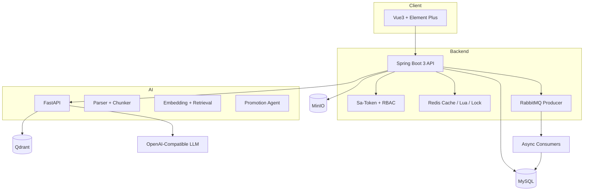

# PromoBrain 架构设计

## 1. 总体架构

PromoBrain 采用轻量三端架构：

- `frontend`: Vue3 管理后台，负责业务流程展示和运营操作。
- `backend`: Spring Boot 单体服务，负责核心业务、权限、缓存、预算扣减、MQ 和数据库。
- `ai-service`: FastAPI AI 服务，负责文档解析、切分、Embedding、向量召回、文案生成、审核和推广 Agent。



## 2. 模块边界

### Frontend

前端聚焦后台管理风格，页面包括登录、Dashboard、商品、知识库、广告计划、素材生成、关键词推荐、广告请求模拟、预算流水、素材审核、任务中心和系统管理。

### Backend

后端第一版采用单体工程，按业务包拆分：

- `auth/user/role/permission`: 登录、用户、角色、权限点。
- `merchant/product`: 商家和商品中心。
- `knowledge`: 知识库文档、索引任务和 chunk 元数据。
- `campaign/creative/keyword`: 广告计划、素材和关键词推荐。
- `serving`: 广告在线请求模拟。
- `budget`: Redis Lua 预算扣减、幂等、预算流水。
- `audit/task/feedback`: 审核任务、异步任务和用户反馈。
- `dashboard`: CTR、CVR、ROI 和趋势统计。

### AI Service

AI 服务独立部署，所有外部模型调用都需要支持超时、降级和 mock：

- 文档解析和 chunk 切分。
- Embedding 和 Qdrant 向量入库。
- 语义召回和 rerank。
- 广告文案生成。
- 关键词推荐辅助。
- 素材审核。
- 推广 Agent。

## 3. 权限模型

角色：

- `admin`: 平台管理员。
- `merchant_admin`: 商家管理员。
- `operator`: 广告运营。
- `analyst`: 数据分析员。

权限控制负责判断“能不能做动作”，数据隔离负责判断“能不能操作这条数据”。核心业务表统一包含：

- `merchant_id`
- `created_by`
- `created_at`
- `updated_at`
- `is_deleted`

## 4. 广告请求链路

广告请求接口需要尽量避免查库：

```text
广告请求
  -> 参数校验
  -> 读取广告计划 Redis 缓存
  -> 读取商品和素材 Redis 缓存
  -> 多路召回候选广告
  -> 过滤预算不足广告
  -> 过滤审核未通过素材
  -> 排序
  -> MQ 记录曝光日志
  -> 返回广告结果
```

## 5. 预算扣减链路

点击扣费必须保证不能超扣、不能扣成负数、不能重复扣：

```text
点击请求
  -> 校验 requestId
  -> 执行 Redis Lua
  -> 扣减成功
  -> 发送 MQ 点击扣费消息
  -> 异步写 ad_event_log
  -> 异步写 budget_transaction
  -> 定时任务对账
```

Lua 负责在 Redis 内原子完成幂等判断、预算判断和扣减。MySQL `budget_transaction.request_id` 唯一索引用于兜底。

## 6. 知识库链路

```text
上传文件
  -> 保存 MinIO
  -> 创建 knowledge_doc
  -> 创建 async_task
  -> AI 服务解析文档
  -> chunk 切分
  -> Embedding
  -> Qdrant 入库
  -> MySQL 保存 chunk 元数据
  -> 更新文档状态
```

文档状态：`UPLOADED`、`PARSING`、`CHUNKING`、`EMBEDDING`、`INDEXED`、`FAILED`。

## 7. 降级策略

- 文案生成失败：返回模板文案。
- 向量检索失败：使用关键词检索。
- 素材审核失败：转人工审核。
- 广告排序失败：使用默认排序。
- 模型接口不可用：启用 mock provider。

## 8. 第二版架构扩展

第二版仍保持 Spring Boot 单体，不提前拆微服务，只在单体内部补齐互联网项目常见的性能、稳定性和可观测性能力。

### Caffeine 多级缓存

- Caffeine 作为本地一级缓存，缓存热点商品、广告计划、演示快照和混合检索结果。
- Redis 继续作为共享缓存、预算扣减和幂等控制组件。
- 后续接入真实广告请求链路时，读取顺序为：Caffeine -> Redis -> MySQL。

### Sentinel 限流降级

- 广告请求资源：`ad-serving-request`。
- AI 素材生成资源：`ai-creative-generate`。
- 第一阶段使用本地静态规则，后续可接 Sentinel Dashboard 或 Nacos 动态规则。
- 触发限流时返回明确降级结果，不阻断主页面。

### Prometheus / Grafana

- 后端通过 Spring Boot Actuator 暴露 `/actuator/prometheus`。
- Prometheus 抓取后端指标。
- Grafana 作为可视化面板入口，后续补充广告请求 QPS、预算扣减成功数、AI 调用耗时、MQ 积压等面板。

### Elasticsearch 混合检索

- Elasticsearch 承接关键词检索和广告规则检索。
- Qdrant 承接向量语义检索。
- 后端 `HybridSearchService` 负责合并候选并排序。
- Elasticsearch 不可用时，混合检索降级为 mock 关键词结果 + Qdrant/mock 语义结果。
